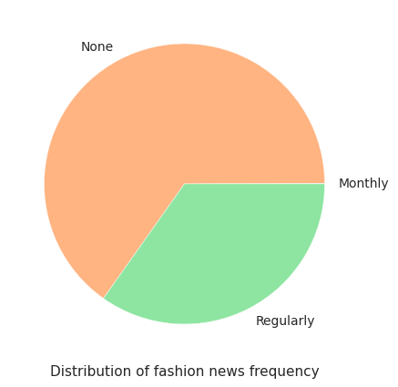
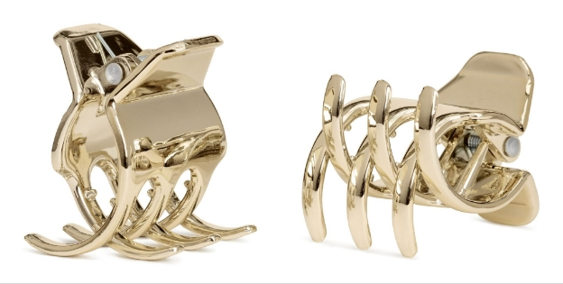

# StyleGenius 🦋🔍

**PROJECT** - Personalized Fashion Recommendations based on previous purchases. 

**Dataset**: [H&M Group Recommendation Dataset (Kaggle Competition)](https://www.kaggle.com/competitions/h-and-m-personalized-fashion-recommendations)

# **Goals**

1. Collect data and conduct data analysis. Visual reports.  

2. Evaluate Classification Models **(Decision Trees, Random Forests, Linear Regression)** with Deep Learning Models **(CNN, RNN etc)** and based on the outcome Design and implement one or more deep learning systems, experiment with various algorithms to maximize the learning capability. Evaluate the performance and document findings.

# **Problem Statement** 
 
We are asked to create a product recommendation for 7 products for each customer using the datasets given from us.

## Working Method 

By grouping the characteristics of people who buy products sold in a store, we can assume that people in that group will be inclined to buy that product.

We will continue this approach in our solution process, take the characteristics of the people who buy each product, classify our products and make an estimate for each customer. 

We will make these estimations by finding which group the customer belongs to from the products purchased in the past, and by giving the most purchased products in that group. 

While making these estimates, in order not to destroy the value of the customer's most recent product, we will act as a separate customer who has only purchased the last product for the first 4 products, and will use the other purchased products for the remaining 3 products. If our customer has bought only 1 product, we will act as 1 customer and bring all products from that class.

## Solution Method :

1. A DF will be created including the characteristics of the users who bought each product, and classification will be made with this information.
2. Then, each customer's information will be given to this model and its class will be found.
3. Estimates will be made so that the first four of the products in its class are from the last purchased product, and the remaining 3 are from other purchased products.

# **Dataset Overview**

**There are 3 metadata .csv files and 1 image file:**

- 📸 images - images of every article_id
- 🙋 articles - detailed metadata of every article_id **(105,542 data points)**
- 👔 customers - detailed metadata of every customer_id **(1,371,980 data points)**
- 🧾 transactions_train - file containing the customer_id, the article that was bought and at what price **(31,788,324 data points)**

## Article Metadata:

        article_id : A unique identifier of every article.
        product_code, prod_name : A unique identifier of every product and its name (not the same).
        product_type, product_type_name : The group of product_code and its name
        graphical_appearance_no, graphical_appearance_name :The group of graphics and its name
        colour_group_code, colour_group_name: The group of color and its name
        perceived_colour_value_id, perceived_colour_value_name, perceived_colour_master_id, perceived_colour_master_name: The added color info
        department_no, department_name : A unique identifier of every dep and its name
        index_code, index_name: : A unique identifier of every index and its name
        index_group_no, index_group_name : A group of indices and its name
        section_no, section_name : A unique identifier of every section and its name
        garment_group_no, garment_group_name : A unique identifier of every garment and its name
        detail_desc : Details
        
## Customer Metadata:

        customer_id : A unique identifier of every customer
        FN : 1 or missed
        Active : 1 or missed
        club_member_status : Status in club
        fashion_news_frequency : How often H&M may send news to customer
        age : The current age
        postal_code : Postal code of customer

## Transactions Metadata:

        t_dat : A unique identifier of every customer
        customer_id : A unique identifier of every customer (in customers table)
        article_id : A unique identifier of every article (in articles table)
        price : Price of purchase
        sales_channel_id : 1 or 2s
        
# **Exploratory Data Analysis**

## **Articles**:

1. **Ladieswear accounts for a significant part of all dresses. Sportswear has the least portion.**

1. **The garments grouped by index: Jersey fancy is the most frequent garment, especially for women and children. The next by number is accessories, many various accessories with low price.**

1. **70% of products are either ladieswear or children's wear.**

1. **Most sold product is the Dragonfly dress.**

1. **Ladieswear and Children/Baby have subgroups.**

1. **Accessories are really various, the most numerous: bags, earrings and hats. However, trousers prevail.**

1. **Trousers are the most sold product type followed by dress and sweater**

1. **Total Frequent product Appearances is solid. And the most frequent color is black in the products bought.**

## Customers:

1. **The most common age is about 21-23**

1. **Status in H&M club. Almost every customer has an active club status, some of them begin to activate it (pre-create). A tiny part of customers abandoned the club.**
1. **Customers prefer not to get any messages about the current news.**

## Transactions:

1. **Denims, Trousers and Undergarments are sold the most.**
2. **The prices are altered, with the highest one being 0.59 and the lowest being 0.0000169.**
3. **The most expensive items are leather garments.**
4. **The average order has around 23 units and costs ~0.649.**
5. **The units/order is directly correlated with the price/order: as the units increase, the price within the order increases too.**

# **Data Processing**

A dataset is prepared from  articles, customers and transactions tables that includes the characteristics of the users who bought each product. A lot of preprocessing is done to make this dataset combining all the features and hot encoding a lot of them. In the end we get a dataset with **529 features.**

We use PCA to reduce the features. I determined that we can get 95% variability with 135 features so I am going to reduce them to **135 features** using principal component analysis.

I will then sort these products into clusters based on these characteristics.

Determine the best value for clusters using the elbow method. I have now grouped the products into 27 clusters. We will then divide the data into train and test and compare performance of different models on this dataset.
# **Evaluation of Models**

These results obtained for different model are

All the models are performing very well. It is mainly because of our good data preprocessing and feature engineering. Our model predicts the cluster in which the product lies. There are **26 clusters** based on the characteristics of customer, product etc. Highest accuracy is given by Feed Forward Neural Network which is 0.984.

Furthermore, some further preprocessing is done to account for customer details in prediction and are inserted in the dataset of 529 features to make it more than that. We make some precautions to deal with missing values, combine all and then predict with our models. The below result is from the prediction of XGBoost Classifier.

Now I will use these 7 predictions to recommend similar items.

# **Recommend Similar Products**

We use the Faiss, a library for efficient similarity search and clustering of dense vectors. It builds an index based on the vectors of the items (products) in the dataset and labels them with their respective index names. The index is then used to find similar items for a given item by calculating the L2 distance between the query vector and the indexed vectors. 

The search is performed in a brute-force manner using various heuristics to avoid computing distances for all vectors. The output is a dataset of items and lists similar items for each item in the dataset. 

This is used to generate a set of recommended items for a specific customer by finding similar items for each of the customer's predicted items. The recommended items are then displayed as a grid of images.

I am using the predicted classes for the next 7 days for a customer and for each item I am recommending 10 similar items using the above method.
# **Demo**
I made a simple demo for the recommendation of items based on an image. Here is the image

The recommendations I got are shown below.

Finally, you can play around it in Google colab with this link: [H&M Predictions Colab Notebook](https://colab.research.google.com/drive/1YdP9oGoKCVe9_tPutf55-EFo0-N7n14E?usp=sharing)

## Refernces

1. https://www.kaggle.com/code/datamaniactr/h-m-recommendation-classification-eng/notebook
2. https://www.kaggle.com/code/andradaolteanu/h-m-eda-rapids-and-similarity-recommenders#6.-Prepare-Datasets

## License

This Notebook has been released under the Apache 2.0 open source license.

Product Recommendation:
-----------------------

Here in this demo i have done away with the preprocessing pipeline and am using the data ready for model input. In actual production enviorment you will have to prepare 
the pipeline as well.

The modeling.csv has 4903 products prepared in prediction input form. So when you say i want to predict the recommendation for a product. Although I am allowing you to select an image using tkinter what is happening is that the filename of the image is also the article_id in the modeling.csv. So the preprocessed data for the image to be put as input has been put in modeling.csv.So only images that you select that have data in modeling will work which are 4903 out of 115000 something.

So the product is selected from the modeling.csv. I pass this prodcut to the model lgbm which i have imported. This model predicts the cluster in which the dataset lies in. Lets say for a product model predicts 16th cluster. I have a dataset prepared by predicting the clusters for 5000 items. In each cluster there are 200-300 items. I see the cluster my product lies in a choose the top 7 products. Then i also have prepared a similarity search dataset. So for each product i have 10 similar products which i prepared using faiss similarity search. Each of the 115000 products have 10 recommendation in this one. So Now i have 70 predicted products.

1. Contains the data ready for input phase

        df_all_values = pd.read_csv('./modeling.csv')

2. Containes the 5000 already predicted entries the format is article_id, cluster, buying_count

        df_article_cluster = pd.read_csv('./articles_clusters.csv')

3.  Dataset made using 10000 transactions that have customer and the products they bought

        df_TRS_TR_OneCus = pd.read_csv('./Customer_Articles.csv')

4. Dataset prepared that matched similar items

        similar_items_df = pd.read_csv('./similar_items.csv')

I am using tkinter to upload Image.

Customer Recommendation:
-----------------------

Here in this demo i have done away with the preprocessing pipeline and am using the data ready for model input. In actual production enviorment you will have to prepare 
the pipeline as well.

The modeling.csv has 4903 products prepared in prediction input form. So when you say i want to predict the recommendation for a product. 

The customer has to be one from the df_TRS_TR_OneCus dataset. The product data for the articles bought by this customer is taken from the modeling.csv. So the article that the person has bought its preprocessed data is selected from the modeling.csv file. For each customer even though some have 2,3 4 or even more we only look at the latest product purchased. I pass this prodcut to the model lgbm which i have imported. This model predicts the cluster in which the dataset lies in. 

Lets say for a product model predicts 16th cluster. I have a dataset prepared by predicting the clusters for 5000 items. In each cluster there are 200-300 items. I see the cluster my product lies in a choose the top 7 products. Then i also have prepared a similarity search dataset. So for each product i have 10 similar products which i prepared using faiss similarity search. Each of the 115000 products have 10 recommendation in this one. So Now I have 70 predicted products.

1. Contains the data ready for input phase

        df_all_values = pd.read_csv('./modeling.csv')

2. Containes the 5000 already predicted entries the format is article_id, cluster, buying_count

        df_article_cluster = pd.read_csv('./articles_clusters.csv')

3.  Dataset made using 10000 transactions that have customer and the products they bought

        df_TRS_TR_OneCus = pd.read_csv('./Customer_Articles.csv')

4. Dataset prepared that matched similar items

        similar_items_df = pd.read_csv('./similar_items.csv')
